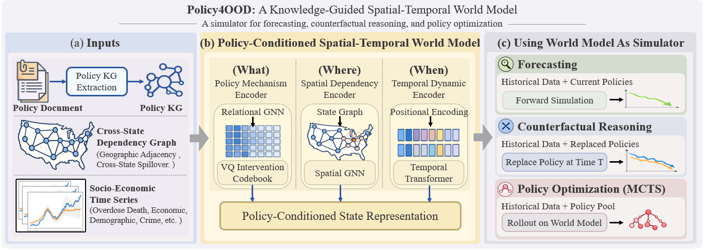

# Policy4OOD: A Knowledge-Guided World Model for Policy Intervention Simulation against the Opioid Overdose Crisis

This is the official implementation of [Policy4OOD](https://arxiv.org/abs/2602.12373), a knowledge-guided spatio-temporal world model that unifies forward forecasting, counterfactual reasoning, and policy optimization for policy intervention simulation targeting opioid overdose crisis.

Policy4OOD reframes opioid policy evaluation as world modeling, explicitly capturing what policies implemented, where their effects propagate, and when their impacts unfold, enabling robust simulation and decision support under unseen socio-economic environments.

---

## ✨ Method Overview

The overall framework is featured by:

- **End-to-end data-driven world-model-based policy simulation**: A policy-conditioned spatio-temporal world model is designed to serve as a differentiable simulator, supporting forward forecasting, counterfactual analysis, and policy optimization within a unified framework.

- **Structured policy understanding via knowledge graphs**: Convert raw legislative documents into structured policy knowledge graphs, preserving relational semantics among policy instruments and enabling explicit reasoning over multi-policy interactions.

- **Canonical intervention discovery with vector quantization**: Discover reusable and interpretable intervention strategies through a shared VQ codebook, reducing policy sparsity and enabling generalization across states, time periods, and unseen policy combinations.

- **Spatial dependency modeling**: Model cross-state spillover effects using a spatial graph neural network over geographical adjacency, capturing diffusion of opioid overdose and regional policy interactions.

- **Policy-conditioned dynamic representation fusion**: Jointly integrate time-dependent socio-economic state representations and pathway-aware policy representations, enabling context-aware simulation of how policies interact with evolving local conditions.

- **Policy optimization with Monte Carlo Tree Search (MCTS)**: Treat the learned world model as a fast simulator and perform combinatorial policy search via MCTS to identify intervention sequences that minimize predicted adverse outcomes.

- **Strong out-of-distribution generalization**: Achieve robust performance under cross-state generalization and unseen deployment settings by learning intervention-level transition mechanisms instead of state-specific correlations.

<p align="center">
  
</p>


---

## 🚀 How to Run

### Setup

Install dependencies via:

```bash
pip install -r requirements.txt
```

Please download data from [here](https://drive.google.com/drive/folders/1IKvYXRK56iQA7vV8bItL7NcXpVWpJmGO?usp=sharing). Unzip `processed_data.zip` and `KG.zip` under `processed_data/` and `KG/` respectively.

### Basic Usage: Forward Simulation

To train Policy4OOD and conduct basic forward simulation:

```bash
python train.py --run_name Policy4OOD
```

To train and evaluate Policy4OOD under OOD setting:

```bash
python train.py --run_name Policy4OOD --ood
```

For each run, you must specify different `--run_name` to avoid checkpoint override. Running logs can be found under `logs/`, while model checkpoints can be found under `saved_models/`, which will be automatically created.

### Policy Knowledge Graph Construction

To process your own policy documents, constructing policy knowledge graph for each state at each timestamp as required by Policy4OOD, we recommend you to follow instructions below:

- **Document Organization**: For each timestamp t, collect all active policy documents until t and put them under the same `raw_policy/input/` directory. You can customize the path according to your demands. 

- **Knowledge Graph Construction**: Run GraphRAG with GPT-4o-mini to construct a unified policy knowledge graph for the specified state at specified timestamp. You can refer to the [docs](https://microsoft.github.io/graphrag/get_started/) to modify detailed configurations. Generally, you only need to run following script after proper configuration, and you can find the outputs in `raw_policy/output/`:

```bash
cd raw_policy
graphrag init ./
graphrag index
```

- **Knowledge Graph Embedding Extraction**: Among all the output files, we only need `output/relationships.parquet`, in which the extracted triplets will be recorded. Based on your own file structure, you can customize the KG preprocessing code we provide in `preprocess/policy_process.py` and transform the triplets into the form that can be learned by Policy4OOD. The KG-related files are required to be manually organized into following structure:

```text
KG/
├── 0/                     # State index
├───── 0/                  # Time index with policy changes
├────────adj.npy           # Graph structure
├────────edge.npy          # Edge feature
├────────node.npy          # Node feature
├───── 1/                  # Time index
├───── ...
├───── kg_idx.npy          # Knowledge graph timeline
├── 1/                     # State index
├── ...
```

### Counterfactual Analysis and Policy Optimization

Manual operations and code customization are needed for both counterfactual analysis and policy optimization.

- **Counterfactual Analysis**: To replace policy, you need to reconstruct the policy knowledge graph for influenced timestamps and replace the KG-related files in `KG/`. To change the implementation time of policy or completely remove policy, if there are no policy enacted after the target policy, you can customize the code in `loadkg()` of `train.py`, where you can find detailed instructions. Otherwise, please reconstruct the policy knowledge graph using GraphRAG.

- **Policy Optimization**: You can directly run `analysis/MCTS.py` for MCTS-based policy optimization. Make sure there is an available model checkpoint before runnning policy optimization. To test your own case, please change the specified state, time range and candidate policy documents, and run GraphRAG to construct the knowledge graphs corresponding to each possible policy combination. You can find detailed explanation in `analysis/MCTS.py`. 

---

## 🔧 Configuration Options

We list some important configuration options below:

### Basic Parameters
- `--run_name`: experiment name (affects logging and checkpoint paths).
- `--input_step`: Number of historical time steps \( T_h \) used as model input.  
- `--output_step`: Number of future time steps \( T_f \) to forecast.  
- `--num_runs`: Number of independent runs with different random seeds.  

### Model Architecture
- `--hidden_dim`: Hidden dimension of the spatial–temporal world model.
- `--num_heads`: Number of attention heads in the Transformer-based encoder.
- `--enc_layers`: Number of Transformer encoder layers.
- `--time_feat_dim`: Dimension of time encoding used to inject temporal order information.

### Policy Representation
- `--text_dim`: Dimension of raw policy text embeddings (e.g., SBERT output).
- `--policy_dim`: Dimension of the projected policy embedding after vector-quantized intervention retrieval.  
- `--range`: Specify a temporal range for case studies or policy simulation.

For complete configuration options, please refer to `utils/load_configs.py`.

---

## 📦 Repository Structure

```text
Policy4OOD/
├── analysis/           # MCTS-based policy optimization
├── models/             # Policy4OOD backbone and components
├── assets/             # Images and assets
├── utils/              # Utility functions
├── processed_data/     # Dataset storage 
├── KG/                 # Policy knowledge graph storage
├── train.py                   # Main Entry point
├── evaluate_model_utils.py    # Evaluation functions
├── requirements.txt           # Required dependencies
└── README.md
```

## 📚 Citation

If you find this work useful, please cite our paper:

```bibtex
@misc{ma2026policy4ood,
      title={Policy4OOD: A Knowledge-Guided World Model for Policy Intervention Simulation against the Opioid Overdose Crisis}, 
      author={Yijun Ma and Zehong Wang and Weixiang Sun and Zheyuan Zhang and Kaiwen Shi and Nitesh Chawla and Yanfang Ye},
      year={2026},
      eprint={2602.12373},
      archivePrefix={arXiv},
}
```

## 👥 Contact

For any questions, please contact `yma7@nd.edu`.

## 🙏 Acknowledgements

This project builds upon the excellent work from:
- [GraphRAG](https://github.com/microsoft/graphrag)
- [PyTorch-Geometric](https://github.com/pyg-team/pytorch_geometric)

We thank these projects for their valuable contributions.